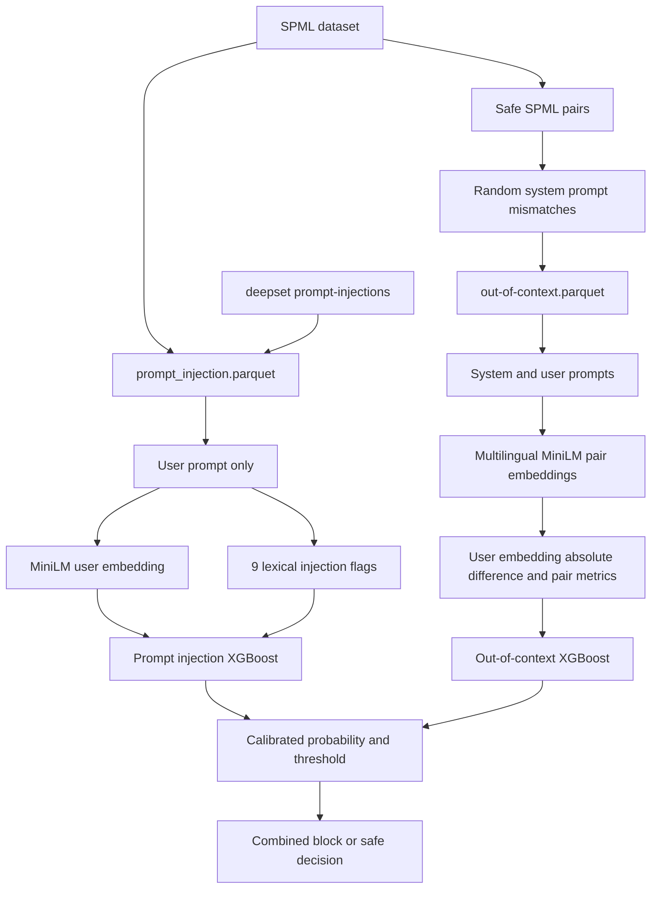

# Prompt Security Experiments

O projeto possui tres detectores independentes: prompt injection, out-of-context e toxicity. Cada tarefa tem seu proprio dataset, schema de features, calibracao e threshold.

## Arquitetura



## Datasets

### Prompt injection

[data/prompt_injection.parquet](../data/prompt_injection.parquet) combina:

- `reshabhs/SPML_Chatbot_Prompt_Injection`
- `deepset/prompt-injections`

O dataset final tem 16.580 user prompts unicos. Repeticoes exatas sao removidas e conflitos de rotulo interrompem a geracao. O split e agrupado por `user_prompt`, impedindo que o mesmo texto apareca em mais de uma particao.

Colunas:

- `user_prompt`
- `prompt_injection`
- `split`
- `source`
- `sample_id`

O modelo nao recebe `system_prompt`.

### Out of context

[data/out-of-context.parquet](../data/out-of-context.parquet) tem 6.940 linhas balanceadas. Ele usa somente exemplos seguros do SPML:

- `out_of_context=0`: par system/user original
- `out_of_context=1`: mesmo user prompt associado aleatoriamente a outro system prompt do mesmo split

O split e definido por `system_prompt` antes da geracao dos mismatches. Assim, system prompts de treino nao aparecem em validacao ou teste. Cada `pair_id` contem um exemplo alinhado e um mismatch.

Colunas:

- `system_prompt`
- `user_prompt`
- `out_of_context`
- `split`
- `pair_id`

## Features

O encoder compartilhado e `sentence-transformers/paraphrase-multilingual-MiniLM-L12-v2`, com embeddings de 384 dimensoes.

### Prompt injection: 393 features

- user embedding: 384
- nove flags lexicas de injection

As flags cobrem exfiltracao, termos de instrucao, linguagem de restricao, delimitadores, override, `ignore` e troca de papel. Nenhuma feature do system prompt e calculada para este classificador.

### Out of context: 772 features

- user embedding: 384
- diferenca absoluta entre system e user embeddings: 384
- cosine similarity
- Euclidean distance
- Manhattan distance
- dot product

Esse classificador combina o conteudo semantico do user prompt com a diferenca por dimensao e medidas globais da relacao entre system prompt e user prompt.

## Treino

Ambos usam XGBoost, calibracao isotonic em metade da validacao e selecao de threshold na outra metade.

```bash
.venv/bin/python src/build_datasets.py
.venv/bin/python src/train.py --task all
```

Com `--task all`, as tarefas sao executadas em processos paralelos. Por padrao,
o numero de workers e limitado pela quantidade de tarefas e os nucleos de CPU
sao divididos entre os XGBoost. Os limites podem ser definidos explicitamente:

```bash
.venv/bin/python src/train.py --task all --workers 3 --xgb-jobs 4
```

Cada worker carrega uma instancia do modelo de embeddings. Use `--workers 1`
para execucao sequencial quando houver pouca RAM ou uma unica GPU.

Tambem e possivel treinar uma tarefa isolada:

```bash
.venv/bin/python src/train.py --task prompt_injection
.venv/bin/python src/train.py --task out_of_context
```

Artefatos:

- `artifact/prompt_injection_model.pkl`
- `artifact/out_of_context_model.pkl`

## Experimentos comparativos

Os notebooks comparam Decision Tree, Random Forest e XGBoost. Cada algoritmo usa uma grade compacta de tres configuracoes dos hiperparametros de maior impacto, com selecao e calibracao feitas somente na validacao.

| Task | Vencedor | Recall | PR-AUC | Latencia end-to-end |
|---|---|---:|---:|---:|
| Prompt injection (threshold 0,2) | XGBoost / Baseline + LDA | 99,26% | 99,91% | 31,26 ms/amostra |
| Out of context | XGBoost | 80,39% | 89,75% | 6,13 ms/amostra |
| Toxicity | Decision Tree / Baseline | 96,43% | 96,21% | 4,30 ms/amostra |

A latencia inclui preprocessing em lote e inferencia do classificador. Ela e uma media por amostra no batch de teste do ambiente da execucao, nao um percentil de requisicoes online. Os workbooks em `results.xlsx` incluem as configuracoes avaliadas, hiperparametros vencedores e os componentes de latencia.

## Inferencia

```bash
.venv/bin/python src/predict.py \
  --system-prompt "You are a travel agent." \
  --user-prompt "How do I create a Python virtual environment?"
```

A resposta contem probabilidade, predicao e threshold de cada detector. A decisao agregada e `blocked` quando qualquer modelo retorna `detected`.

## Limitacoes

Os rotulos de out-of-context sao sinteticos, nao anotados por humanos. Um system prompt aleatorio pode ainda ser semanticamente compativel com o user prompt, o que introduz ruido de rotulo e explica o FPR atual. Esse modelo deve ser validado com exemplos reais do dominio antes de uso em producao.

O notebook [experiment.ipynb](experiment.ipynb) registra o estudo exploratorio original de prompt injection. Os tres experimentos possuem datasets e tarefas de treino; a inferencia agregada em `src/predict.py` ainda combina somente prompt injection e out-of-context.
